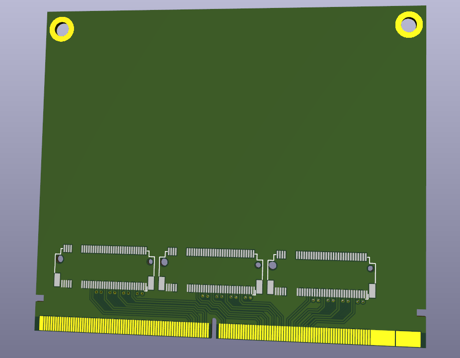
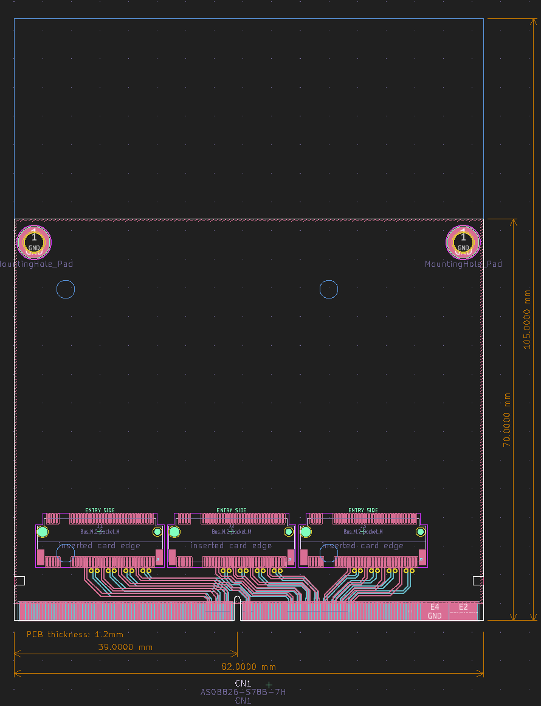

# MXM NVMe

I made an MXM edge connector footprint and wanted to make a board that uses it so I can make some screenshots, so here's a crappy unfinished concept for a board that lets you use one or maybe more NVMe SSDs in an MXM slot. Currently wired for x8x4x4 bifurcation mode.

Feel free to take the MXM edge connector footprint from it.

## Here's some pictures
<!------>

I didn't do impedance matching or anything yet, the diffpairs are just there to look pretty ✨

